# iris-perceptron

This project uses the perceptron algorithm for building three binary classifiers (perceptron.py):

- setosa vs non-setosa
- versicolor vs non-versicolor
- virginica vs non-virginica

Then it uses the three perceptrons as building blocks to form a neural network (neural-network.py) which classifies the
iris data-set into its three classes (i.e. setosa, versicolor, virginica).

The visualize.py can be used to visualize the iris data-set.

## Usage

```bash
py visualize.py
```

```bash
py perceptron.py <class>
```

Where class can be:

- setosa (for Setosa Vs non-Setosa classification)
- versicolor (for Versicolor Vs non-Versicolor classification)
- virginica (for Virginica Vs non-Virginica classification)

```bash
py neural-network.py
```

## Examples

```bash
py perceptron.py <class>

Classifying setosa Vs non-setosa
The algorithm converged
Number of iterations:  2344

All points classified correctly!
```

```bash
py neural-network.py

Total misclassified points:  8
Accuracy:  94.66666666666667 %

Classification of the Iris dataset:

Data Point      Actual Class            Predicted Class
0               Iris-setosa             Iris-setosa
1               Iris-setosa             Iris-setosa
2               Iris-setosa             Iris-setosa
...
```

## Data-set visualization

|                                            |                                             |
| ------------------------------------------ | ------------------------------------------- |
| 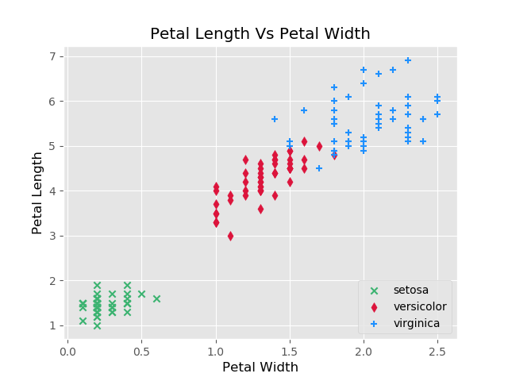 | 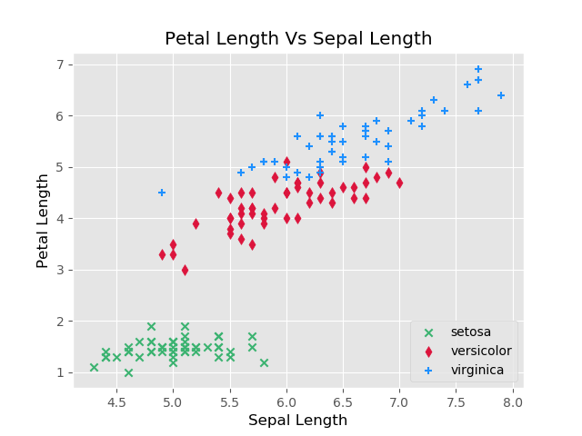 |

|                                            |                                            |
| ------------------------------------------ | ------------------------------------------ |
| 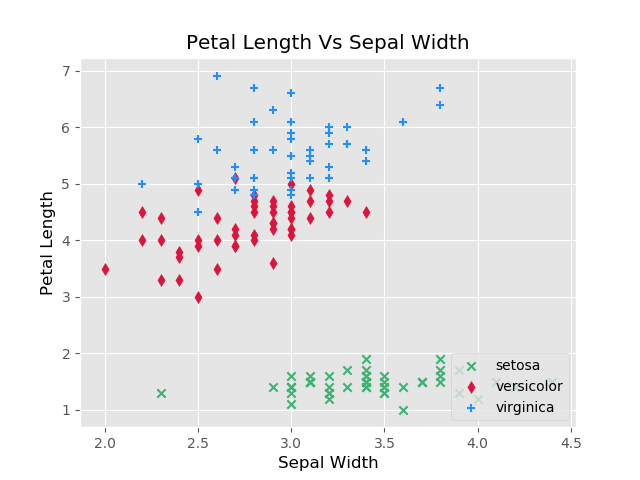 | 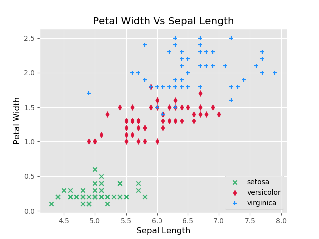 |

|                                           |                                            |
| ----------------------------------------- | ------------------------------------------ |
| 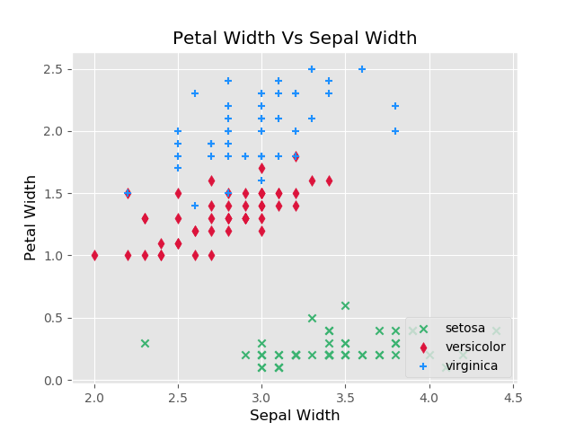 | 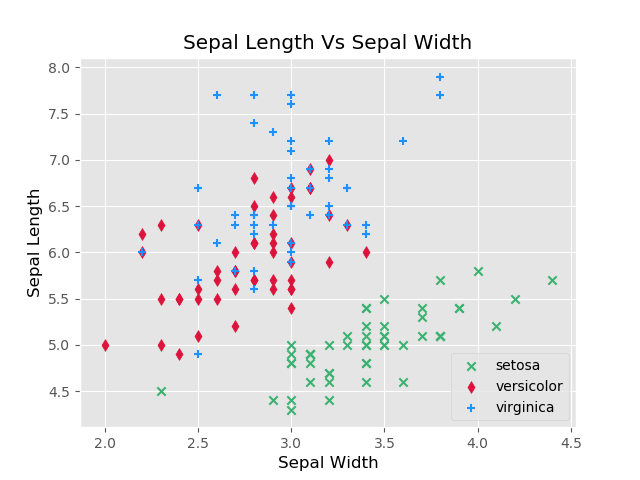 |

## The Perceptron Algorithm:

1. Start with a random set of weights w.
2. Pick an arbitrary pattern x ∈ C1 ∪ C2.
3. If x ∈ C1 and x · w < 0 goto 2. Else w → w − λx. Goto 2
4. If x ∈ C2 and x · w ≥ 0 goto 2. Else w → w + λx. Goto 2

## Building the Perceptrons

1. setosa vs. non-setosa

From the scatter plots in the figures above, it can be seen that the setosa class is linearly separable from the versicolor
and virginica classes because in any of the 6 plots we can draw a straight line that separates the points of the setosa
class from the points of the other two classes. Thus, setosa vs.non-setosa can be learnt by a perceptron. More
specifically, setosa vs. non-setosa can be classified just by using any two of the four features (petal length, petal
width, sepal length and sepal width) or even just by using only one of the features petal length or petal width.

There are many combinations of four weights and a bias which can classify setosa vs. non-setosa.
One example of weights and bias is derived from figure of Petal Length vs Petal Width.

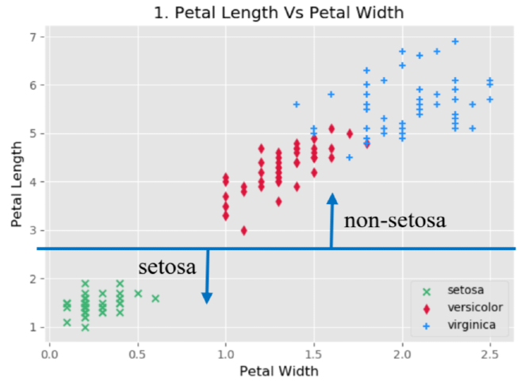

One line that separates setosa vs non-setosa classes in the Petal Length against Petal Width plot
is y - 2.5 = 0. Anything below this line is classified as setosa and anything above this line is
classified as non-setosa. From the parameters of the line we can determine the weights. Wsl = 0,
Wsw = 0, Wpl = 1, Wpw = 0, Wbias = -2.5 as depicted in the figure of the perceptron below:

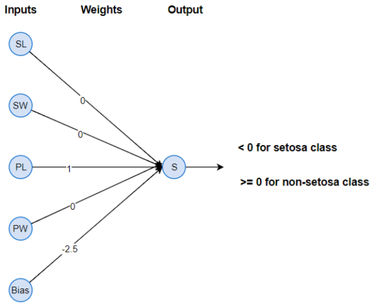

2. virginica vs. non-virginica

The virginica vs non-virginica problem is not linearly separable as no line in any of the two-dimensional graphs can
separate all the virginica data points from the non-virginica because some of the data points of the virginica and the
versicolor classes overlap.

By using a learning rate, the weights converge because the small number of data points that keep hitting the ’Else’
clauses of the perceptron algorithm cannot make big changes on the values of the weights. Thus, the perceptron manages 
to find a hyperplane that nearly separates (only a few misclassified points) the virginica vs. non-virginica points 
(which is on the margin of the virginica and versicolor classes as seen in the graphs above). However, there will always 
be some misclassified points, because no single hyperplane in the four dimensions can separate all of the virginica from
the versicolor points.

3. versicolor vs. non-versicolor

The difference between versicolor and the other two classes is obvious in the graphs above, as the points of the 
versicolor class are located between the points of the other two classes. Thus, unlike setosa and versicolor, you 
cannot draw a single line that even almost separates the versicolor from the non-versicolor points.

So even by using a learning rate, there is no change in the result and the algorithm keeps making the same number of 
misclassifications.

## Building the neural network

The setosa vs non-setosa and the virginica vs non-virginica perceptrons are used in combination with the following
three output artificial neurons in order to build a neural network that outputs (1, 0, 0) for versicolor, (0,1,0) for
setosa and (0,0,1) for virginica.

1. The versicolor output neuron gives 1 if both the setosa and virginica perceptrons gave 0. This is the NOR function.
   Thus, the following neuron can be used:

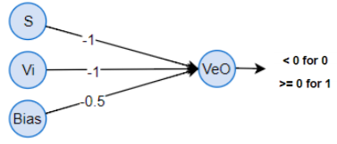

2. The setosa output neuron gives 1 if the setosa perceptron gave 1. This can be implemented with the OR function, but
   we only want to output 1 if only the setosa input is 1, so we can set the virginica weight to 0. Thus, the following
   neuron can be used:

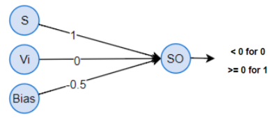

3. The virginica output neuron gives 1 if the virginica perceptron gave 1. with the same logic as the setosa neuron.
   Thus, the following neuron can be used:

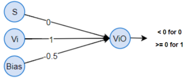


The full network:

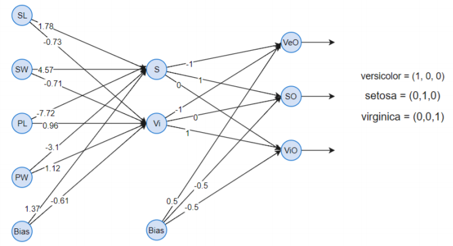

Where:
- SL = Sepal Length
- SW = Sepal Width
- PL = Petal Length
- PW = Petal Width
- S = Setosa perceptron for classifying setosa vs non-setosa
- Vi = Virginica perceptron for classifying virginica vs non-virginica
- VeO = Versicolor output artificial neuron that outputs 1 if the instance is classified as
versicolor
- SO = Setosa output artificial neuron that outputs 1 if the instance is classified as setosa
- ViO = Virginica output artificial neuron that outputs 1 if the instance is classified as
virginica
- Bias = 1

Accuracy of the network:

| Run | Accuracy (%) |
|-----|--------------|
| 1   | 98           |
| 2   | 97.33        |
| 3   | 93.33        |
| 4   | 97.33        |
| 5   | 98           |
| 6   | 98.67        |
| 7   | 91.33        |
| 8   | 94.67        |
| 9   | 98           |
| 1   | 0 94.67      |

Average = 96.13 %

Standard Deviation = 2.24 %